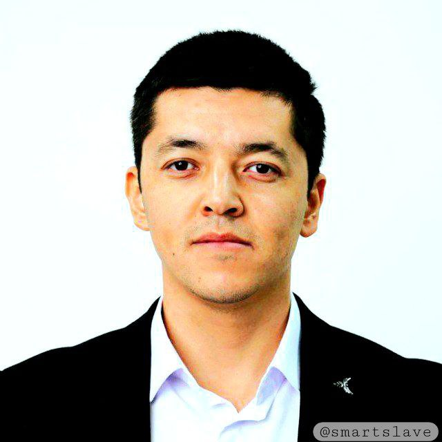
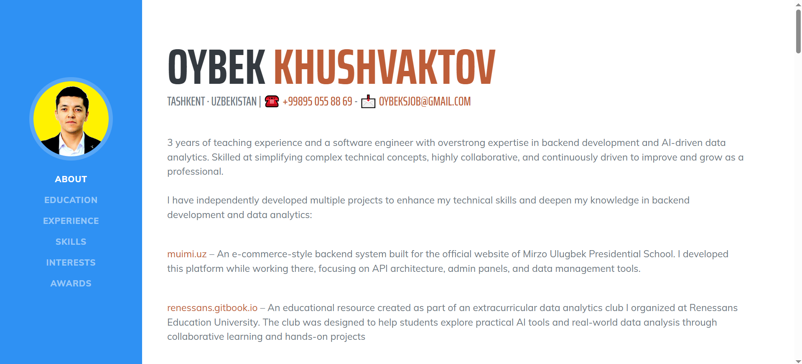

# MEN HAQIMDA

Ismim <mark style="color:blue;">**Oybek Xushvaqtov**</mark>

<figure><figcaption>
Xushvaqtov Oybek Asliddin o'g'li
</figcaption></figure>

2 yildan beri [Renessans ta'lim universiteti](https://renessans-edu.uz/uz/) Axborot texnologiyalari kafedrasi assistent o'qituvchisi bo'lib ishlab kelaman

Magistratura bosqichi o'qish davrida **Mirzo Ulug'bek nomidagi ixtisoslatirilgan prezitend maktabi** o'quvchilarga dasturlash asoslaridan klub tashkil qilib 1 yil davomida dars o'tganman.

men haqimda batafsil ma'lumotni ushbu saytdan tanishishingiz mumkin - [https://oybekjohn.github.io/](https://oybekjohn.github.io)

<figure><figcaption>
<a href="https://www.oybekjohn.github.io/">https://oybekjohn.github.io</a>
</figcaption></figure>
