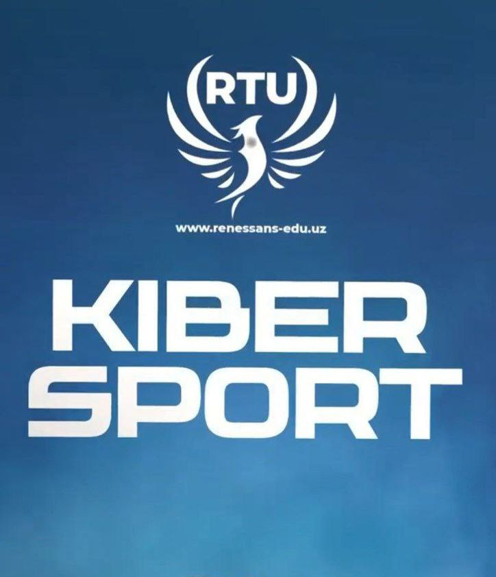

# KIBERSPORT

**Kibersport** yoki **e-sport** — bu video o‘yinlar bo‘yicha professional darajada tashkil etilgan musobaqalar va turnirlar tizimi. Bu sportning raqamli shakli bo‘lib, o‘yinchilar (pro-gamerlar) jamoalar yoki yakka holda raqobatlashadi.

<figure><figcaption></figcaption></figure>

***

#### Kibersportning tarixi

* Kibersport 1970-yillardan boshlab rivojlana boshladi, ammo 2000-yillardan so‘ng internetning keng tarqalishi va video o‘yinlarning ommaviylashuvi bilan katta hajmga erishdi.
* Hozirgi kunda e-sport millionlab tomoshabinlar va yuz minglab professional o‘yinchilarni o‘ziga jalb qilgan global sanoatga aylandi.

***

#### Kibersport turlari

Eng mashhur kibersport o‘yinlari:

* **MOBA janri:** Dota 2, League of Legends (LoL)
* **FPS janri:** Counter-Strike: Global Offensive (CS:GO), Valorant
* **Battle Royale:** PUBG, Fortnite
* **Sport simulyatsiyalari:** FIFA, NBA 2K
* **Strategiya:** StarCraft II

***

#### Kibersportning asosiy komponentlari

1. **Professional o‘yinchilar va jamoalar:**
   * O‘yinchilar professional darajada mashq qilishadi, jamoaviy strategiyalar ustida ishlashadi.
   * Jamoalar xalqaro turnirlarda ishtirok etadi.
2. **Turnirlar va musobaqalar:**
   * Har yili dunyo bo‘ylab minglab turnirlar o‘tkaziladi.
   * Eng yiriklari — The International (Dota 2), League of Legends World Championship, CS:GO Major Championships.
3. **Tashkilotchilar va platformalar:**
   * Valve, Riot Games, Blizzard va boshqa yirik kompaniyalar e-sportni qo‘llab-quvvatlaydi.
   * Twitch, YouTube, Facebook Gaming kabi platformalar orqali jonli efirlar ko‘rsatiladi.
4. **Tomoshabinlar va hamjamiyat:**
   * Millionlab odamlar onlayn va oflayn tarzda musobaqalarni tomosha qiladi.
   * Kibersport hamjamiyati juda faol va globaldir.

***

#### Kibersportning ijobiy tomonlari

* Yoshlar uchun yangi ish va kasb imkoniyatlari (pro-gamer, trener, analitik, streamerni)
* Strategik fikrlash, tezkor qaror qabul qilish va jamoaviy hamkorlikni rivojlantiradi.
* Dunyo bo‘ylab yangi do‘stlar va hamkorlik imkoniyatlari yaratadi.

***

#### Kibersport va jamiyat

* Ko‘plab davlatlarda kibersport rasmiy sport turi sifatida tan olingan.
* Universitetlar va kollejlar kibersport stipendiyalari va jamoalarini tashkil qilmoqda.
* Kibersport sanoati iqtisodiy jihatdan ham juda katta o‘sishga ega.

<figure><figcaption></figcaption></figure>

